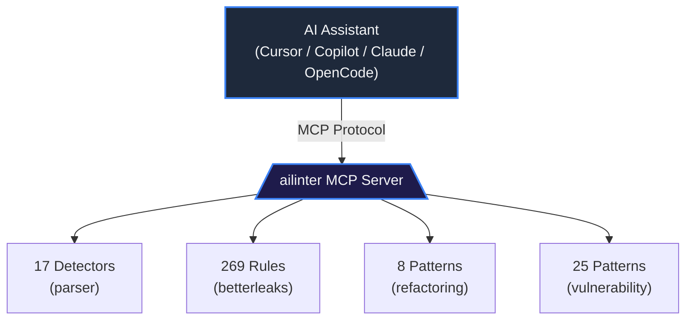

<picture>
  <source media="(prefers-color-scheme: dark)" srcset="https://raw.githubusercontent.com/ailinter/ops/main/branding/logo/icon.png">
  
</picture>

# ailinter

### AI Code. Human Standards.

> The open-source safety visor for AI-assisted development. Scans code quality, secrets, and vulnerabilities before and after every AI edit — directly in your editor.

[](https://go.dev/)
[](LICENSE)
[](https://modelcontextprotocol.io)
[](https://github.com/ailinter/ailinter/actions)
[](https://github.com/ailinter/ailinter/releases)

<p align="center">
  Created by <a href="https://github.com/IvanBern">Ivan Bernikov</a>
</p>

---

**Your AI assistant doesn't know if a file is a disaster waiting to happen.** ailinter gives it a pre-flight checklist. Every file gets a 0–100 quality score, and the AI is told whether to Go Ahead, Proceed with Care, or Stop & Refactor — *before* it generates a single line.

> AI is **60% more likely to introduce defects** in code with high complexity, deep nesting, or brain methods. Frontier LLMs fix only ~20% of quality issues without guidance. With MCP-augmented guidance, fix rates reach **90–100%**.

---

## Quick Start

```bash
# Install (Go)
go install github.com/ailinter/ailinter/cmd/ailinter@latest

# Scan a file
ailinter check src/main.go

# Initialize a project with .ailinter.toml + AGENTS.md
ailinter init

# Start MCP server for any AI assistant
ailinter mcp
```

### Add to Your AI Assistant

```json
{
  "mcpServers": {
    "ailinter": {
      "command": "ailinter",
      "args": ["mcp"]
    }
  }
}
```

> **Config locations:** OpenCode: `opencode.json` · Claude Code: `.claude/mcp.json` · Cursor: `.cursor/mcp.json` · VS Code: `.vscode/mcp.json`

---

## What It Does

| | | |
|---|---|---|
| **Code Quality** | 17 structural detectors | 0–100 quality score per file |
| **Secret Scanning** | 269 detection rules | 203% recall vs gitleaks baseline |
| **Vulnerability Patterns** | 25 OWASP Top 10 patterns | 100% recall, zero false positives |
| **AI Refactoring Guide** | 8 step-by-step patterns | Guard clauses, extract method, SRP |
| **Git Hotspots** | Churn × complexity analysis | Find the files most likely to break |
| **Traffic-Light Score** | Go Ahead / Care / Stop | Tells AI when to back off |

### The Quality Score

Every file gets a **0–100 score** that tells AI assistants whether it's safe to modify:

| Score | Label | Guidance |
|-------|-------|----------|
| **95–100** | Go Ahead | Safe for AI modification |
| **75–94** | Proceed with Care | Use small changes, re-check after each edit |
| **0–74** | Stop & Refactor | Refactor BEFORE AI touches this file |

---

## Why ailinter?

| Capability | ailinter | SonarQube MCP | gitleaks |
|------------|:---:|:---:|:---:|
| Code Quality (0–100 score) | Full | Full | — |
| Complexity Analysis | 17 detectors | Full | — |
| Secret Scanning | **269 rules** | Basic | 150 rules |
| Vulnerability Patterns | **25 patterns** | Partial | — |
| Refactoring Guide | 8 patterns | — | — |
| AI Prompt Injection | Yes | — | — |
| Pre-Edit Safety Check | Yes | — | — |
| Post-Edit Secret Scan | Yes | — | — |
| Git Hotspot Analysis | Yes | — | — |
| Binary Size | **~15MB** | ~400MB Docker | ~10MB |
| Dependencies | **Zero** | Docker + JVM | Zero |
| Setup Time | **<1 min** | ~1 hour | <1 min |
| License | **MIT** | LGPL+Proprietary | MIT |

> Secret scanning powered by [betterleaks](https://github.com/betterleaks/betterleaks) 269-rule engine, embedded at compile time.

## Benchmarks

### Secret Detection — 31-File Multi-Language Corpus

| Tool | Rules | Secrets Found | False Positives | Speed |
|------|:---:|:---:|:---:|------:|
| **ailinter** | **269** | **71** | 0 on React/NestJS | 186ms |
| gitleaks | 150 | 35 (baseline) | 0 on all repos | 196ms |
| trufflehog | 800+ | 15 | 0 on all repos | 11,292ms |
| detect-secrets | entropy | 70 | 6 on Express | 1,034ms |
| semgrep | contextual | 19 | 5 across repos | 2,706ms |

### Vulnerability Pattern Detection

| Metric | Result |
|--------|--------|
| Recall | **100%** (40/40 patterns) |
| False Positives | **0** on clean code |
| Speed (small file) | ~149 µs |
| Speed (large file, 500KB) | ~12 ms |

---

## Five Pillars of Protection

### 1. Code Quality Radar (Pre-Edit)

**17 detectors** with per-language thresholds based on academic research and industry standards. 13 languages supported.

| Detector | What It Catches | Threshold |
|----------|----------------|-----------|
| Deep Nesting | Brace-level nesting | >3-4 levels |
| Brain Method | Oversized functions | >60-80 lines |
| File Bloat | God Class risk | >600-1000 lines |
| Bumpy Road | Multiple deep blocks taxing working memory | ≥2 bumps, depth ≥2 |
| Complex Conditional | Excessive `&&`/`\|\|` branches | >2 branches |
| Long Parameter List | Too many function params | >4 params |
| Cyclomatic Complexity | Per-function branch count | >7-9 CC |
| Code Duplication | SHA256 fingerprint matching | ≥8 lines, >75% |
| Message Chains | `a.b().c()` violations | ≥2 chained calls |
| Primitive Obsession | Primitive-type overload | ≥4 primitive params |
| And 7 more… | Cohesion, Comments, Global Data, Lazy Elements, etc. | Language-dependent |

### 2. Secret Scanning (Post-Edit)

**269 rules** across 100+ providers. 2× broader than gitleaks' 150-rule default.

| Category | Examples | Rules |
|----------|----------|:---:|
| Cloud Providers | AWS, GCP, Azure, DigitalOcean | 15 |
| AI/ML Services | Anthropic, Cohere, DeepSeek, Perplexity | 12 |
| Dev Platforms | GitHub, GitLab, Bitbucket, Atlassian | 10 |
| Payment | Stripe, PayPal, Shopify | 8 |
| Communication | Slack, Discord, Twilio, SendGrid | 7 |
| Private Keys | RSA, DSA, EC, PGP, SSH | 6 |
| And more… | 1Password, Adobe, Yandex, Zendesk… | 180+ |

Every finding includes an AI prompt instructing the LLM to use environment variables.

### 3. AI Refactoring Guide

**8 embedded patterns** with step-by-step instructions:

| Smell | Pattern |
|-------|---------|
| Deep Nesting | Guard Clauses + Extract Method |
| Brain Method | Extract Method Decomposition |
| Bumpy Road | Extract Method per Bump |
| Complex Conditional | Decompose Conditional |
| God Class | Extract Class (SRP) |
| Long Parameter List | Introduce Parameter Object |
| Primitive Obsession | Replace with Value Object |
| Duplicated Code | Extract Method / Pull Up |

### 4. Vulnerability Pattern Detection

**25 deterministic patterns** covering OWASP Top 10. Pure regex matching, no LLM call needed.

| Category | Patterns | Examples |
|----------|:---:|----------|
| Deserialization | 8 | `pickle.load`, `torch.load`, `yaml.load()` |
| Command/Code Injection | 6 | `os.system()`, `eval()`, `new Function()` |
| XSS | 6 | `innerHTML`, `dangerouslySetInnerHTML` |
| Weak Cryptography | 3 | ECB mode, `createCipher`, TLS disabled |
| XXE + Workflow | 2 | Unsafe XML, Actions editing |

### 5. Infrastructure + Dependency Guard (v0.6)

Coming next: IaC scanning (Terraform, CloudFormation, Docker, K8s) and dependency SCA.

---

## Supported Languages

**13 languages** with full detector coverage. **12 additional formats** with structural and secret scanning.

| Language | Extensions | Detectors |
|----------|------------|:---:|
| Go | `.go` | 17/17 |
| Python | `.py` | 17/17 |
| JavaScript | `.js` | 17/17 |
| TypeScript | `.ts`, `.tsx` | 17/17 |
| Java | `.java` | 17/17 |
| C/C++ | `.c`, `.cpp`, `.h`, `.hpp` | 17/17 |
| Rust | `.rs` | 17/17 |
| Ruby | `.rb` | 17/17 |
| Swift | `.swift` | 17/17 |
| Kotlin | `.kt`, `.kts` | 17/17 |
| C# | `.cs` | 17/17 |

Config formats also scanned for secrets: `.env`, `Dockerfile`, `Makefile`, `.npmrc`, etc.

### Default Thresholds

| Metric | Go | Python | JS/TS | Java |
|--------|:--:|:--:|:--:|:--:|
| Nesting depth | 4 | 4 | 3 | 4 |
| Cyclomatic complexity | 9 | 9 | 9 | 9 |
| Function LOC | 80 | 70 | 60 | 70 |
| File LOC | 1000 | 600 | 700 | 600 |
| Max function args | 4 | 4 | 4 | 5 |

Customize via `.ailinter.toml`.

---

## Installation

### Go Install

```bash
go install github.com/ailinter/ailinter/cmd/ailinter@latest
```

### Pre-built Binaries

Linux, macOS, and Windows binaries on the [Releases page](https://github.com/ailinter/ailinter/releases).

### From Source

```bash
git clone https://github.com/ailinter/ailinter.git
cd ailinter && make build && make install
```

### Verify

```bash
ailinter --version
ailinter rules list
```

---

## Usage

### CLI

```bash
ailinter check src/main.go              # Single file
ailinter check --json src/main.go       # JSON output
ailinter check --format markdown src/   # LLM-friendly output
ailinter check --format problems src/   # VS Code / CI integration
ailinter check --no-secrets src/        # Skip secret scanning
ailinter check --lang python script.py  # Force language
ailinter init                           # Create .ailinter.toml + AGENTS.md
ailinter init --vscode                  # Also create .vscode/tasks.json
ailinter rules list                     # Show default thresholds
```

### MCP Server

Start the MCP server: `ailinter mcp`

| Tool | Purpose |
|------|---------|
| `analyze_code` | Full structural analysis with 0-100 quality score |
| `scan_for_secrets` | 269-rule secret detection across 100+ providers |
| `get_refactoring_strategy` | Exact step-by-step refactoring instructions |
| `assess_file` | Quick classification: Go Ahead / Proceed with Care / Stop & Refactor |
| `list_hotspots` | Frequently-changed files with low quality scores |
| `set_config` | Set persistent configuration |
| `get_config` | View current configuration |

### MCP Config

```bash
# Start as MCP server
ailinter mcp
```

**OpenCode** (`opencode.json`) · **Claude Code** (`.claude/mcp.json`) · **Cursor** (`.cursor/mcp.json`) · **GitHub Copilot** · **Codex** · **Windsurf** · **Continue.dev** — all supported via stdio MCP.

---

## Architecture



**Stack:** Go 1.25 · [mcp-go](https://github.com/mark3labs/mcp-go) SDK · [betterleaks](https://github.com/betterleaks/betterleaks) rules · [cobra](https://github.com/spf13/cobra) CLI · MIT license

**Build targets:** darwin/amd64, darwin/arm64, linux/amd64, linux/arm64, windows/amd64 · **Binary:** ~15MB, zero dependencies, <100ms startup

---

## Configuration

Create `.ailinter.toml` with `ailinter init`:

```toml
[thresholds]
nesting_warning = 4
cyclomatic_warning = 9
function_loc_warning = 80
file_loc_warning = 1000
```

Or via MCP: `set_config("language", "python")` · `set_config("read_only", "true")`

---

## Development

```bash
make build       # Build to bin/ailinter
make test        # Run all tests
make test-cover  # Tests with coverage
make bench       # Run benchmarks
make lint        # go vet
make fmt         # Format code
make release     # Cross-platform build
```

### Project Structure

```
cmd/ailinter/           # CLI entry point
internal/
├── analyzer/           # Orchestrator + scoring engine
├── cli/                # CLI commands (check, mcp, init)
├── config/             # Persistent JSON config
├── mcp/                # MCP server + 7 tool handlers
├── parser/             # 17 code smell detectors
├── refactoring/        # 8 embedded refactoring patterns
└── secrets/            # betterleaks-based secret scanner
testdata/               # Test fixtures
```

---

## Community

- **Contributing**: [CONTRIBUTING.md](CONTRIBUTING.md)
- **Security**: [SECURITY.md](SECURITY.md)
- **Changelog**: [CHANGELOG.md](CHANGELOG.md)
- **Issues**: [github.com/ailinter/ailinter/issues](https://github.com/ailinter/ailinter/issues)

---

## License

[MIT](LICENSE) — built on open-source: [gitleaks](https://github.com/gitleaks/gitleaks) (MIT), [betterleaks](https://github.com/betterleaks/betterleaks) (MIT), [mcp-go](https://github.com/mark3labs/mcp-go) (MIT), [cobra](https://github.com/spf13/cobra) (Apache-2.0).

Code smell definitions adapted from [Samman Coaching Reference](https://sammancoaching.org/reference/code_smells/index.html) by Emily Bache, [CC BY-SA 4.0](https://creativecommons.org/licenses/by-sa/4.0/).

---

## Project Status

| Version | Phase | Status |
|---------|-------|--------|
| **0.5.0-dev** | 17 detectors, 7 MCP tools, CLI | Complete |
| 0.6 | IaC scanning, dependency SCA | In development |
| 0.7 | Pre-commit hooks, diff-aware analysis | Planned |
| 1.0 | AI-aware gate (PreToolUse/PostToolUse) | Planned |
