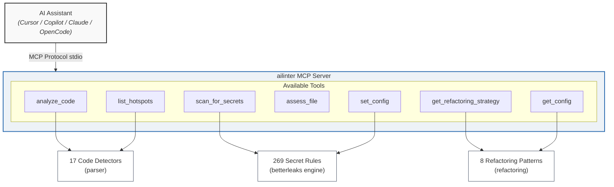

# ailinter — AI Linter & Code Governance MCP

[](https://go.dev/)
[](LICENSE)
[](https://modelcontextprotocol.io)

**ailinter** is an open-source AI linter and safety visor for AI-assisted development. It provides real-time structural analysis and safety checks to LLM coding assistants (Cursor, Copilot, Claude, OpenCode) — before and after they generate or modify code.

Created by [Ivan Bernikov](https://www.linkedin.com/in/ivanbernikov/) ([@IvanBern](https://github.com/IvanBern)).

> Research shows AI is up to **60% more likely to introduce defects** in code with high cyclomatic complexity, deep nesting, or "Brain Methods." ailinter gives the LLM contextual awareness of a file's structural quality BEFORE it generates code.

---

## Quick Start

```bash
# Install
go install github.com/ailinter/ailinter/cmd/ailinter@latest

# Analyze a file
ailinter check src/main.go

# Analyze a whole directory
ailinter check ./src

# Initialize a project (creates .ailinter.toml + AGENTS.md)
ailinter init

# Start MCP server for AI assistants
ailinter mcp
```

### Setup with AI Assistants

**Personal skill** (works with Claude Code, OpenCode, Cursor, GitHub Copilot, Codex, Gemini CLI, and 25+ other tools):

```bash
mkdir -p ~/.claude/skills/ailinter
cp SKILL.md ~/.claude/skills/ailinter/
```

**MCP server** (add to your config):

```json
{
  "mcp": {
    "ailinter": {
      "type": "local",
      "command": ["ailinter", "mcp"]
    }
  }
}
```

> OpenCode: `opencode.json` | Claude Code: `.claude/mcp.json` | Cursor: `.cursor/mcp.json` | VS Code: `.vscode/mcp.json`

---

## Four Pillars of Protection

### 1. Code Quality Radar (Pre-Edit)

Structural analysis with **17 detectors** producing a **0-100 quality score**:

| Detector | What It Catches | Threshold |
|----------|----------------|-----------|
| Deep Nesting | Brace-level nesting beyond warning/alert limits | >3-4 levels (lang-dependent) |
| Brain Method | Functions exceeding LOC limits per language | >60-80 lines (lang-dependent) |
| File Bloat | God Class risk from oversized files | >600-1000 lines (lang-dependent) |
| Bumpy Road | Multiple deeply-nested blocks taxing working memory | ≥2 bumps, depth ≥2 |
| Complex Conditional | Excessive `&&`/`\|\|` branches in if/while | >2 branches |
| Long Parameter List | Functions with too many parameters | >4 params |
| Cyclomatic Complexity | Per-function branch counting | >7-9 CC (lang-dependent) |
| Code Duplication | SHA256-normalized fingerprint matching | ≥8-10 lines, >75% similarity |
| Cohesion Analysis | Shared-type analysis; low cohesion detection | <50% shared-type score |
| Message Chains | `a.b().c()` law-of-demeter violations | ≥2 chained calls |
| Primitive Obsession | Primitive-type overload in signatures | ≥4 primitive-type params |
| Excessive Comments | Comment lines dominating source | >30% of non-blank lines |
| Global Data | Mutable top-level variable declarations | ≥5 declarations |
| Long Scope Variables | Variables declared far from last use | ≥50 line span |
| Lazy Elements | Functions with negligible body | <3 lines |
| Paragraph of Code | Consecutive non-blank lines without separation | >20 consecutive lines |
| Long Switch | Switch/case statements with many branches | >10 cases (warn) |

### 2. Secret Scanning (Post-Edit)

**269 detection rules** — ailinter embeds the [betterleaks](https://github.com/betterleaks/betterleaks) rule set (evolved from gitleaks) for 2× broader coverage than gitleaks' 150-rule default:

| Category | Examples | Rules |
|----------|----------|:---:|
| **Cloud Providers** | AWS, GCP, Azure, DigitalOcean, Cloudflare, Alibaba | 15 |
| **AI/ML Services** | Anthropic, Cohere, Cerebras, DeepSeek, Perplexity, XAI | 12 |
| **Dev Platforms** | GitHub (classic + fine-grained PAT), GitLab, Bitbucket, Atlassian | 10 |
| **Payment & Finance** | Stripe, PayPal, Shopify, Coinbase, Bittrex | 8 |
| **Communication** | Slack, Discord, Twilio, SendGrid, Mailgun | 7 |
| **Private Keys** | RSA, DSA, EC, PGP, SSH, AGE | 6 |
| **Databases & Infra** | Databricks, ClickHouse, Vault, Vercel, Confluent | 20+ |
| **Generic Detection** | Entropy ≥ 3.5 + keyword pre-filtering, credentials in URLs | 10 |
| **And more...** | 1Password, Adobe, Airtable, Authress, Cursor, Yandex, Zendesk... | 180+ |

**Total: 269 rules** across 100+ providers. Falls back to gitleaks 150-rule default if config parsing fails. Every finding includes an AI prompt instructing the LLM to use environment variables.

> **Benchmark:** On a 31-file multi-language test corpus, ailinter with 269 rules found **71 secrets (203% recall)** vs gitleaks 150-rule baseline of 35. Zero false positives on React and NestJS clean repos. [Full benchmark →](benchmarks/expanded-report.html)

Support custom rule sets via `ailinter.NewScannerConfig(tomlString)` in the Go API.

### 3. AI Refactoring Guide

**8 embedded refactoring patterns** with exact step-by-step instructions:

| Smell | Pattern |
|-------|---------|
| Deep Nesting | Guard Clauses + Extract Method |
| Brain Method | Extract Method Decomposition |
| Bumpy Road | Extract Method per Bump |
| Complex Conditional | Decompose Conditional |
| God Class | Extract Class (SRP) |
| Long Parameter List | Introduce Parameter Object |
| Primitive Obsession | Replace with Value Object |
| Duplicated Code | Extract Method / Pull Up |

### 4. Infrastructure + Dependency Guard (Planned)

Coming in v0.6: IaC security scanning (Terraform, CloudFormation, Docker, K8s) and dependency SCA (hallucinated package detection + OSV.dev CVE lookup).

---

## Supported Languages

**13 languages** with per-language thresholds tuned from CodeScene defaults and academic research:

| Language | Extensions | Detectors | Notes |
|----------|------------|:---:|-------|
| Go | `.go` | 17/17 | Brace-counting with method receiver support |
| Python | `.py` | 17/17 | Indent-based with decorator/class/nested function support |
| JavaScript | `.js` | 17/17 | Keyword/brace + arrow function detection |
| TypeScript | `.ts`, `.tsx` | 17/17 | Same engine as JavaScript |
| Java | `.java` | 17/17 | Brace-counting with annotation, generic, and modifier support |
| C/C++ | `.c`, `.cpp`, `.cc`, `.cxx`, `.h`, `.hpp` | 17/17 | Prefix-aware with destructor and operator support |
| Rust | `.rs` | 17/17 | `fn`-based with pub(crate)/async modifier support |
| Ruby | `.rb` | 17/17 | `def`/`end` based |
| Swift | `.swift` | 17/17 | `func`-based with private/mutating/override support |
| Kotlin | `.kt`, `.kts` | 17/17 | `fun`-based with suspend/inline/operator modifier support |
| C# | `.cs` | 17/17 | Brace-counting with modifier support |

**12 additional formats** scanned with structural heuristics (nesting depth, file size, secrets):

Scala (`.scala`), PHP (`.php`), Perl (`.pl`), Shell (`.sh`), Bash (`.bash`), Terraform (`.tf`), YAML (`.yml`, `.yaml`), TOML (`.toml`), JSON (`.json`), XML (`.xml`), HTML (`.html`), CSS (`.css`), SQL (`.sql`)

**Config files** also scanned for secrets: `.env`, `.env.*`, `.properties`, `.ini`, `.cfg`, `.conf`, `Dockerfile`, `Makefile`, `.gitignore`, `.npmrc`, `.dockerignore`

These are analyzed for nesting depth, file size, and secrets — function-level detectors (Brain Method, Bumpy Road, cohesion) are not applicable to non-code formats.

### Default Language Thresholds

| Metric | Go | Python | JS/TS | Java |
|--------|:--:|:--:|:--:|:--:|
| Nesting depth (warn) | 4 | 4 | 3 | 4 |
| Cyclomatic complexity | 9 | 9 | 9 | 9 |
| Function LOC (warn) | 80 | 70 | 60 | 70 |
| File LOC (warn) | 1000 | 600 | 700 | 600 |
| Max function arguments | 4 | 4 | 4 | 5 |

Customize via `.ailinter.toml` in your project root.

---

## Quality Score Reference

| Score | Label | Guidance |
|-------|-------|----------|
| 95-100 | Go Ahead | Safe for AI modification |
| 75-94 | Proceed with Care | Use guard clauses, prefer small changes, re-check after each edit |
| 0-74 | Stop & Refactor | Refactor BEFORE AI modification. Run `get_refactoring_strategy()` for detected issues. |

---

## Installation

### Go Install

```bash
go install github.com/ailinter/ailinter/cmd/ailinter@latest
```

### Download Binary

Pre-built binaries for Linux, macOS, and Windows on the [Releases page](https://github.com/ailinter/ailinter/releases).

### From Source

```bash
git clone https://github.com/ailinter/ailinter.git
cd ailinter
make build          # Builds to bin/ailinter
make install        # Installs to $GOPATH/bin
sudo make install   # System-wide install
```

### Verify

```bash
ailinter --version
ailinter rules list
```

---

## Usage

### CLI Commands

```bash
# Analyze a single file
ailinter check src/main.go

# Analyze with JSON output
ailinter check --json src/main.go

# Analyze with Markdown output (ideal for LLM context)
ailinter check --format markdown src/main.go

# Output in problem-matcher format (VS Code / CI integration)
ailinter check --format problems src/main.go

# Skip secret scanning
ailinter check --no-secrets src/main.go

# Force a language
ailinter check --lang python script.py

# Scan an entire directory
ailinter check ./src

# Initialize a project (creates .ailinter.toml + AGENTS.md)
ailinter init
ailinter init --vscode          # Also creates .vscode/tasks.json
ailinter init --no-agents       # Skip AGENTS.md

# List default thresholds
ailinter rules list
```

### MCP Server for AI Assistants

Start the MCP server:

```bash
ailinter mcp
```

Configure your AI assistant to use it:

#### OpenCode

Add to `.opencode/opencode.json`:

```json
{
  "mcpServers": {
    "ailinter": {
      "command": "ailinter",
      "args": ["mcp"]
    }
  }
}
```

#### Claude Desktop

Add to `~/Library/Application Support/Claude/claude_desktop_config.json` (macOS) or `%APPDATA%\Claude\claude_desktop_config.json` (Windows):

```json
{
  "mcpServers": {
    "ailinter": {
      "command": "ailinter",
      "args": ["mcp"]
    }
  }
}
```

#### Cursor

Add to `.cursor/mcp.json`:

```json
{
  "mcpServers": {
    "ailinter": {
      "command": "ailinter",
      "args": ["mcp"]
    }
  }
}
```

### Available MCP Tools

| Tool | Purpose |
|------|---------|
| `analyze_code` | Full structural analysis: quality score (0-100), issues, severity, locations |
| `scan_for_secrets` | Secret detection: 100+ providers, 269 rules (betterleaks engine) |
| `get_refactoring_strategy` | Pattern lookup: exact steps + examples for each issue |
| `assess_file` | Quick classification: Go Ahead / Proceed with Care / Stop & Refactor |
| `set_config` | Set persistent config (8 keys) |
| `get_config` | View current config |
| `list_hotspots` | Frequently-changed files with low quality scores |

---

## Why ailinter?

### The Problem

AI models go into every file blind. They don't know how complex a file is before they start editing. Research shows:

- AI is **60% more likely to introduce defects** in unhealthy code
- Frontier LLMs fix only **~20% of code quality issues** without guidance
- With MCP-augmented guidance, fix rates reach **90-100%**

### The Solution

ailinter gives the LLM contextual awareness BEFORE it generates code. When complexity is high, it tells the AI: *"WARNING: This file is a Danger Zone. Use Guard Clauses to flatten logic and Extract Methods before modifying core behavior."*

### Comparison with Other Tools

| Capability | ailinter | CodeScene MCP | SonarQube MCP | gitleaks |
|------------|:---:|:---:|:---:|:---:|
| Code Quality (0-100 score) | Full | Full | Full | — |
| Complexity Analysis | 17 detectors | Full | Full | — |
| Secret Scanning | **269 rules** | — | Basic | 150 rules |
| Refactoring Guide | 8 patterns | Skills | — | — |
| AI Prompt Injection | Yes | Yes | — | — |
| Pre-Edit Safety Check | Yes | Yes | — | — |
| Post-Edit Secret Scan | Yes | — | — | — |
| Git Hotspot Analysis | Yes | Full | — | — |
| Binary Size | ~15MB | ~30MB | ~400MB Docker | ~10MB |
| Dependencies | Zero | Rust runtime | Docker + JVM | Zero |
| Setup Time | <1 min | ~5 min (license) | ~1 hour | <1 min |
| License | MIT | Proprietary | LGPL+Proprietary | MIT |

> Secret scanning powered by [betterleaks](https://github.com/betterleaks/betterleaks) 269-rule engine (evolved gitleaks), embedded at compile time. 2× broader detection than gitleaks alone.

---

## Benchmarks

ailinter is evaluated against **5 other secret scanning tools** and **CodeScene** across multiple open-source datasets. Full report: [`benchmarks/expanded-report.html`](benchmarks/expanded-report.html).

### Secret Detection — 31-File Multi-Language Corpus

| Tool | Rules | Secrets Found | False Positives | Speed |
|------|:---:|:---:|:---:|------:|
| **ailinter** | **269** | **71** | 0 on React/NestJS | 186ms |
| gitleaks | 150 | 35 (baseline) | 0 on all repos | 196ms |
| betterleaks | 269 | 32* | 0 on all repos | 1,386ms |
| trufflehog | 800+ | 15 | 0 on all repos | 11,292ms |
| detect-secrets | entropy | 70 | 6 on Express | 1,034ms |
| semgrep | contextual | 19 | 5 across repos | 2,706ms |

> \* betterleaks counter issue in benchmark runner; detection parity confirmed on per-file tests.

### SecretBench Reference

For methodology-compatible evaluation against the gold-standard SecretBench dataset (MSR 2023, 15,084 true secrets, 97,479 candidates), see [`benchmarks/secretbench-eval/`](benchmarks/secretbench-eval/). The evaluation framework computes precision/recall/F1 using the same methodology as the [FPSecretBench paper](https://arxiv.org/abs/2307.00714) (ESEM 2023), which reported gitleaks at 46% precision — best among open-source tools.

---

## Architecture



**Technical stack:**
- **Language:** Go — single, fast, cross-platform binary
- **Binary size:** ~15MB (zero runtime dependencies)
- **Startup time:** <100ms
- **Protocol:** MCP via [mcp-go](https://github.com/mark3labs/mcp-go) SDK (stdio transport)
- **Secret engine:** [betterleaks](https://github.com/betterleaks/betterleaks) 269-rule config (evolved [gitleaks](https://github.com/gitleaks/gitleaks) v8 engine), embedded at compile time
- **CLI framework:** [cobra](https://github.com/spf13/cobra)
- **Build targets:** darwin/amd64, darwin/arm64, linux/amd64, linux/arm64, windows/amd64

---

## Configuration

### via `.ailinter.toml`

Create in project root with `ailinter init`:

```toml
[thresholds]
nesting_warning = 4
cyclomatic_warning = 9
function_loc_warning = 80
file_loc_warning = 1000
```

### via MCP Tools

```json
set_config("language", "python")
set_config("read_only", "true")
set_config("enabled_tools", "analyze_code,scan_for_secrets")
set_config("disable_git", "false")
```

### Supported Config Keys

| Key | Type | Description |
|-----|------|-------------|
| `language` | string | Default language for analysis |
| `repo_path` | string | Default repository path |
| `enabled_tools` | string | Comma-separated tool allowlist |
| `read_only` | bool | Audit/CI mode — no modifications |
| `disable_git` | bool | Disable git-based features |
| `access_token` | string | CodeScene API token (optional) |
| `onprem_url` | string | CodeScene on-premise URL (optional) |

---

## Development

```bash
# Build
make build

# Run all tests
make test

# Test with coverage
make test-cover

# Run benchmarks
make bench

# Lint
make lint

# Format
make fmt

# Cross-platform release
make release
```

### Project Structure

```
.
├── cmd/ailinter/           # CLI entry point
├── internal/
│   ├── analyzer/           # Orchestrator: runs all detectors, computes score
│   ├── cli/                # CLI commands (check, mcp, init)
│   ├── config/             # Persistent JSON config (~/.config/ailinter/)
│   ├── mcp/                # MCP server + 7 tool handlers
│   ├── parser/             # 17 code smell detectors
│   ├── refactoring/        # Embedded refactoring patterns (8 .md files)
│   └── secrets/            # Gitleaks-based secret scanner
├── testdata/               # 13 test fixture files
├── benchmarks/             # Benchmark scripts and data
├── research/               # Competitive analysis, algorithm design
└── docs/                   # Additional documentation
```

---

## Contributing

Contributions welcome! See [CONTRIBUTING.md](CONTRIBUTING.md) for development setup, code conventions, and PR guidelines.

---

## License

[MIT](LICENSE) — built on open-source: [gitleaks](https://github.com/gitleaks/gitleaks) (MIT), [betterleaks](https://github.com/betterleaks/betterleaks) rules (MIT), [mcp-go](https://github.com/mark3labs/mcp-go) (MIT), [cobra](https://github.com/spf13/cobra) (Apache-2.0).

Code smell definitions adapted from [Samman Coaching Reference](https://sammancoaching.org/reference/code_smells/index.html) by Emily Bache, licensed under [CC BY-SA 4.0](https://creativecommons.org/licenses/by-sa/4.0/).

---

## Project Status

- **Version:** 0.5.0-dev
- **Phase 1:** 17 detectors, 7 MCP tools, CLI — **complete**
- **Phase 1.5:** SAST lite, IaC scanning, dependency SCA — **in development**
- **Phase 2:** Pre-commit hooks, diff-aware analysis — planned
- **Phase 4:** AI-aware gate (PreToolUse/PostToolUse) — planned
