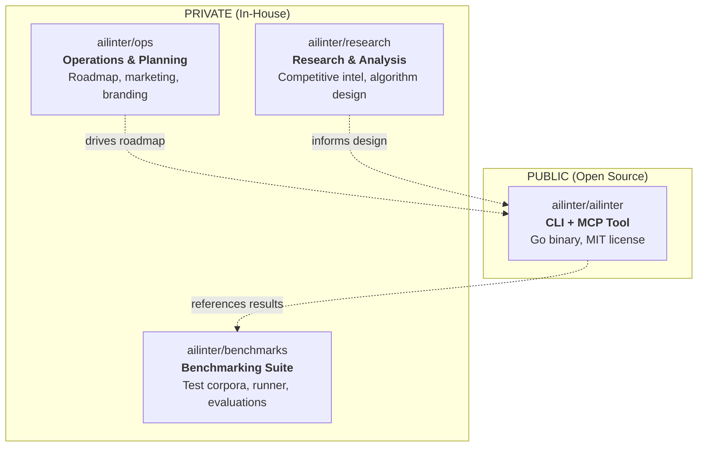

# ailinter — Git Publishing & Multi-Repo Organization Plan

## Project Understanding

**ailinter** is an open-source AI linter and safety visor for AI-assisted development. It's a Go binary (was ~15MB, now ~29MB stripped — final size TBD from @devops-engineer) that provides:

1. **Code Quality Radar** — 17 structural detectors producing a 0-100 quality score
2. **Secret Scanning** — 269 detection rules (betterleaks engine, evolved gitleaks)
3. **AI Refactoring Guide** — 8 embedded patterns with step-by-step instructions
4. **MCP Server** — 7 tools for AI assistants (Cursor, Copilot, Claude, OpenCode, etc.)
5. **CLI** — `check`, `mcp`, `init`, `rules` commands with multiple output formats

**Tech stack:** Go 1.25, cobra CLI, mcp-go SDK, gitleaks v8 engine, MIT license.

**Current state:** `git init` done on `master` branch, **zero commits**, all files untracked.

---

## User Review Required

> [!IMPORTANT]
> **Personal Brand Attribution**: The LICENSE says `Copyright (c) 2026 ailinter` — should this be `Copyright (c) 2026 Ivan Bernikov` or `Copyright (c) 2026 ailinter (Ivan Bernikov)` to tie to your personal brand?

> [!IMPORTANT]
> **GitHub Organization**: You mention `ailinter` org on GitHub. Is `github.com/ailinter` already created? The go.mod already uses `github.com/ailinter/ailinter` as the module path — this needs to match the actual GitHub org/repo.

> [!WARNING]
> **Compiled binaries in repo**: There are 3 compiled binaries in the repo root (`ailinter` 14MB, `main` 3MB, `comprehensive_main` 3.3MB) plus `bin/ailinter` (was 15MB, now ~29MB stripped). These should NOT be committed. The `.gitignore` already excludes `bin/` and root `ailinter`, but `main` and `comprehensive_main` are not excluded.

> [!WARNING]
> **Generated report files in root**: `report.md` (12KB), `coverage-core.out` (82KB), `coverage.out` (94KB), `coverage.html` (191KB), `test-report.html` (99KB), `test-report.json` (258KB) are all in the root. Most are in `.gitignore` but `coverage-core.out` is not.

---

## Open Questions

> [!IMPORTANT]
> **Q1: GitHub Organization ownership** — Do you already have the `github.com/ailinter` organization created? If not, do you want me to help set it up after the plan is approved?

> [!IMPORTANT]
> **Q2: Default branch name** — Currently on `master`. GitHub defaults to `main`. Which do you prefer? (Recommendation: `main` to match CI workflow which references `main`)

> [!IMPORTANT]
> **Q3: SecretBench dataset** — The `SecretBench/` directory is a cloned git repo (separate `.git`). It's a third-party academic dataset. Should it be:
> - (a) Removed from this repo entirely (referenced via docs only)
> - (b) Kept as a git submodule in the private benchmarks repo
> - (c) Something else?

> [!IMPORTANT]
> **Q4: Benchmark test corpus** — `benchmarks/test-corpus/` contains files with intentional fake secrets (`.env.prod`, `keys`, `secrets.tf`, etc.) for benchmarking. These are test fixtures, not real secrets. Should they:
> - (a) Stay in the open-source CLI repo as part of `testdata/` (they demonstrate the tool's capabilities)
> - (b) Move to the private benchmarks repo only
> - (c) Stay but with clear `# FAKE SECRET FOR TESTING` comments

> [!IMPORTANT]
> **Q5: Author identity in README** — The spec says `Author: Ivan Bernikov` but the README doesn't mention you by name. For personal branding, should the README include an "Author" or "Created by" section?

> [!IMPORTANT]
> **Q6: Private development repos** — Beyond the repos I propose below, do you want a dedicated repo for any of these?
> - Website / landing page (`ailinter.dev` or similar)
> - Blog / content marketing
> - VS Code extension (future)
> - Enterprise/SaaS features (future)

---

## Current Project Inventory

### What exists today (by category)

#### Core CLI + MCP (open-source ready) ✅
| Path | Description | Size |
|------|-------------|------|
| `cmd/ailinter/main.go` | CLI entry point, cobra commands | 2.1KB |
| `internal/analyzer/` | Orchestrator, scoring, 4 files | ~20KB |
| `internal/cli/` | check, init, mcp commands + output formatters, 11 files | ~53KB |
| `internal/config/` | JSON + TOML config management, 6 files | ~23KB |
| `internal/mcp/` | MCP server + 7 tool handlers, 4 files | ~25KB |
| `internal/parser/` | 17 detectors + hotspot + thresholds, 21 files | ~120KB |
| `internal/refactoring/` | Embedded patterns + lookup, 2 files + patterns/ | ~5KB |
| `internal/secrets/` | Gitleaks wrapper + betterleaks.toml, 4 files | ~283KB |
| `internal/report/` | Empty package (planned) | 0 |
| `internal/rules/` | Empty package (planned) | 0 |
| `testdata/` | 7 fixture dirs (brain_method, bumpy_road, etc.) | 64KB |

#### Documentation (open-source ready) ✅
| File | Description |
|------|-------------|
| `README.md` | Comprehensive 529-line README with architecture, benchmarks, comparison |
| `CONTRIBUTING.md` | Dev setup, code conventions, PR checklist |
| `CHANGELOG.md` | Detailed v0.5.0-dev changelog |
| `LICENSE` | MIT |
| `AGENTS.md` | AI agent instructions (shipped to user repos via `ailinter init`) |
| `.ailinter.toml` | Example/self-referencing config |

#### Infrastructure (open-source ready) ✅
| File | Description |
|------|-------------|
| `Makefile` | build, test, lint, bench, release targets |
| `go.mod` / `go.sum` | Go module definition |
| `.gitignore` | Comprehensive ignore rules |
| `.github/workflows/ci.yml` | CI: lint, test (80% coverage gate), build, cross-build, benchmark |
| `.github/ISSUE_TEMPLATE/` | Bug report + feature request templates |
| `.github/PULL_REQUEST_TEMPLATE.md` | PR checklist |
| `scripts/install.sh` | curl-based installer |

#### Research (PRIVATE — should NOT be open-sourced) 🔒
| File | Description |
|------|-------------|
| `ailinter-spec.md` | Full product spec with roadmap, competitive analysis, market positioning |
| `research/competitive-landscape-2026-05.md` | Competitive landscape analysis |
| `research/sonarqube-mcp-analysis.md` | SonarQube MCP competitor analysis |
| `research/cycode-owasp-analysis.md` | Cycode/OWASP feature analysis |
| `research/marketing-stats.md` | Marketing angles & statistics |
| `research/mvp-roadmap.md` | Detailed MVP roadmap (34KB!) |
| `research/roadmap.md` | Implementation roadmap |
| `research/references.md` | Bibliography & sources |
| `research/code-smell-catalog.md` | 28 canonical code smells catalog |
| `research/bumpy-road-algorithm.md` | Algorithm design notes |
| `research/gitleaks-integration.md` | Gitleaks integration reference |

#### Benchmarks (PRIVATE — should NOT be open-sourced) 🔒
| Path | Description | Size |
|------|-------------|------|
| `benchmarks/repos/` | Cloned repos (wrongsecrets, betterleaks, mongo drivers) | **2.6GB** |
| `benchmarks/runner/` | Benchmark runner scripts (4 Go files) | ~39KB |
| `benchmarks/test-corpus/` | Multi-language secret corpus (31 files) | 132KB |
| `benchmarks/test-secrets/` | Expected results per tool | 48KB |
| `benchmarks/secretbench-eval/` | SecretBench evaluation framework | ~15KB |
| `benchmarks/data/` | Generated benchmark data | gitignored |
| `benchmarks/*.html` | 3 HTML reports | ~44KB |
| `SecretBench/` | Cloned academic dataset (separate git repo) | 256KB |

#### Scripts (mixed) 🔶
| Path | Open-source? | Description |
|------|:---:|-------------|
| `scripts/install.sh` | ✅ | User-facing installer |
| `scripts/test-report/main.go` | ✅ | Test report generator (referenced in Makefile) |
| `scripts/benchmark-report/main.go` | 🔒 | Benchmark HTML report generator |
| `scripts/comprehensive-report/` | 🔒 | Expanded benchmark report (2 files) |
| `scripts/install/` | — | Empty directory |

#### Junk / Build Artifacts (should be cleaned) 🗑️
| File | Description |
|------|-------------|
| `ailinter` (root) | Compiled binary, 14MB |
| `main` (root) | Compiled binary, 3MB |
| `comprehensive_main` (root) | Compiled binary, 3.3MB |
| `coverage-core.out` | Coverage output, 82KB |
| `coverage.out` | Coverage output, 94KB |
| `coverage.html` | Coverage HTML, 191KB |
| `test-report.html` | Test report, 99KB |
| `test-report.json` | Test report JSON, 258KB |
| `report.md` | Generated analysis report, 12KB |
| `.DS_Store` | macOS metadata |
| `opencode.json` | Local dev tool config |
| `.opencode/` | Local dev tool artifacts |
| `.playwright-mcp/` | Local dev tool artifacts |
| `.vscode/` | Local IDE settings |

---

## Proposed Multi-Repo Strategy

### GitHub Organization: `github.com/ailinter`



---

### Repo 1: `ailinter/ailinter` (PUBLIC) 🌐

The open-source CLI + MCP tool. This is the product your personal brand is built on.

**Contents:**
```
ailinter/
├── cmd/ailinter/          # CLI entry point
├── internal/              # All 9 packages (analyzer, cli, config, mcp, parser, refactoring, secrets, report, rules)
├── testdata/              # Test fixtures
├── scripts/
│   ├── install.sh         # curl installer
│   └── test-report/       # Test report generator
├── .github/               # CI, issue templates, PR template
├── README.md              # Public-facing docs
├── CONTRIBUTING.md
├── CHANGELOG.md
├── LICENSE                # MIT
├── AGENTS.md              # AI agent instructions
├── Makefile
├── .ailinter.toml         # Example config
├── .gitignore
├── go.mod
└── go.sum
```

**What stays OUT:**
- No `research/`, `benchmarks/`, `SecretBench/`
- No `ailinter-spec.md` (internal product spec)
- No `opencode.json`, `.opencode/`, `.playwright-mcp/`, `.vscode/`
- No compiled binaries
- No coverage/report artifacts
- No `scripts/benchmark-report/`, `scripts/comprehensive-report/`

---

### Repo 2: `ailinter/research` (PRIVATE) 🔒

All competitive analysis, algorithm design, and technical research.

**Contents:**
```
research/
├── competitive-landscape-2026-05.md
├── sonarqube-mcp-analysis.md
├── cycode-owasp-analysis.md
├── code-smell-catalog.md
├── bumpy-road-algorithm.md
├── gitleaks-integration.md
├── marketing-stats.md
├── references.md
├── ailinter-spec.md        # Full product spec (moved from root)
├── mvp-roadmap.md
└── roadmap.md
```

---

### Repo 3: `ailinter/benchmarks` (PRIVATE) 🔒

All benchmark infrastructure, test corpora, evaluation frameworks, and results.

**Contents:**
```
benchmarks/
├── runner/                 # Go benchmark runner scripts
├── test-corpus/            # 31-file multi-language secret corpus
├── test-secrets/           # Expected results per tool
├── secretbench-eval/       # SecretBench evaluation framework
├── reports/                # HTML reports
├── scripts/                # Report generators (moved from scripts/)
│   ├── benchmark-report/
│   └── comprehensive-report/
├── SecretBench/            # Academic dataset (submodule or reference)
└── README.md               # How to run benchmarks
```

---

### Repo 4: `ailinter/ops` (PRIVATE) 🔒

Business planning, marketing, roadmaps, and brand strategy.

**Contents:**
```
ops/
├── roadmap/                # Product roadmap, sprint planning
├── marketing/              # Marketing strategy, social media, content calendar
├── branding/               # Logo, visual identity, messaging
├── partnerships/           # Partnership opportunities, integrations
├── analytics/              # Usage metrics, adoption tracking
├── launch-plan/            # Launch checklist, promotion plan
└── README.md
```

---

## Proposed Changes

### Phase 1: Clean up & prepare the public repo

#### [MODIFY] [.gitignore](file:///Users/ivanb/Projects/ailinter/.gitignore)

Add missing exclusions:
```diff
 # Build
 bin/
 dist/
 ailinter
 ailinter.exe
+main
+comprehensive_main
 
 # Coverage and reports
 coverage.out
+coverage-core.out
 coverage.html
 coverage-func.txt
 test-report.json
 test-report.html
 report.md
 
+# Internal/private content (not for open-source)
+ailinter-spec.md
+research/
+SecretBench/
+
+# Benchmark repos and data
+benchmarks/repos/
+benchmarks/data/
+benchmarks/report.html
+
+# Local dev tool configs
+opencode.json
+.opencode/
+.playwright-mcp/
```

#### [MODIFY] [LICENSE](file:///Users/ivanb/Projects/ailinter/LICENSE)

Update copyright to include your name (pending your answer to Q above).

#### [MODIFY] [README.md](file:///Users/ivanb/Projects/ailinter/README.md)

- Add author attribution section for personal brand
- Ensure all links point to `github.com/ailinter/ailinter`
- Remove reference to `docs/` directory (doesn't exist)

---

### Phase 2: Create structured git commits

I'll create a series of logical, well-organized commits on a `main` branch:

| # | Commit Message | Files |
|---|----------------|-------|
| 1 | `chore: initialize project with .gitignore and license` | `.gitignore`, `LICENSE` |
| 2 | `feat: add Go module and dependencies` | `go.mod`, `go.sum` |
| 3 | `feat: add core parser with 17 code smell detectors` | `internal/parser/` (all 21 files) |
| 4 | `feat: add analyzer orchestrator with scoring engine` | `internal/analyzer/` (4 files) |
| 5 | `feat: add secret scanner with betterleaks 269-rule engine` | `internal/secrets/` (4 files) |
| 6 | `feat: add embedded refactoring patterns (8 patterns)` | `internal/refactoring/` |
| 7 | `feat: add persistent config management (JSON + TOML)` | `internal/config/` (6 files) |
| 8 | `feat: add MCP server with 7 tool handlers` | `internal/mcp/` (4 files) |
| 9 | `feat: add CLI commands (check, init, mcp, rules)` | `internal/cli/` (11 files), `cmd/ailinter/` |
| 10 | `feat: add test fixtures for all detectors` | `testdata/` |
| 11 | `feat: add CI pipeline, issue templates, PR template` | `.github/` |
| 12 | `feat: add Makefile with build, test, bench, release targets` | `Makefile` |
| 13 | `feat: add install script and report generator` | `scripts/install.sh`, `scripts/test-report/` |
| 14 | `docs: add README, CHANGELOG, CONTRIBUTING, AGENTS.md` | `README.md`, `CHANGELOG.md`, `CONTRIBUTING.md`, `AGENTS.md` |
| 15 | `chore: add example .ailinter.toml configuration` | `.ailinter.toml` |

> [!NOTE]
> All commits will be on the `main` branch (renamed from `master`). The private content (`research/`, `benchmarks/`, `ailinter-spec.md`, `SecretBench/`, compiled binaries, coverage artifacts) will NOT be committed — they stay on disk but are excluded via `.gitignore`.

---

### Phase 3: Prepare private repos (guidance only)

After the public repo is ready, you can create private repos and move content:

1. **`ailinter/research`** — `git init`, move `research/` + `ailinter-spec.md`
2. **`ailinter/benchmarks`** — `git init`, move `benchmarks/` + `SecretBench/` + benchmark scripts
3. **`ailinter/ops`** — `git init`, create initial structure for roadmap/marketing/branding

I'll provide the exact commands and directory structure for each.

---

## Verification Plan

### Automated Tests
```bash
# After commits, verify the project still builds and tests pass
make build        # Should produce bin/ailinter
make test         # All tests should pass
make lint         # go vet should be clean

# Verify git state
git log --oneline  # Should show 15 clean commits
git status         # Should show private files as untracked (in .gitignore)
```

### Manual Verification
- Review each commit message and contents
- Confirm no private content (research, benchmarks, spec) is committed
- Confirm no compiled binaries are committed
- Confirm no secrets are committed (even test ones in the public repo)
- Verify `.gitignore` properly excludes all private/generated content
